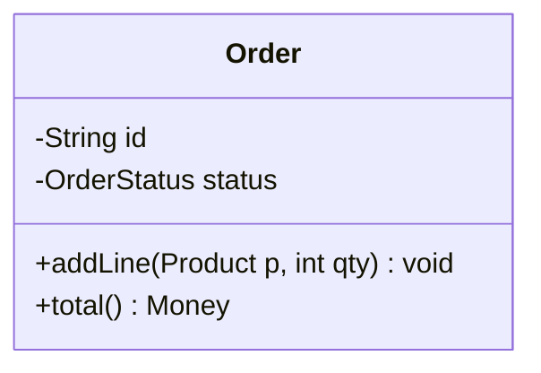
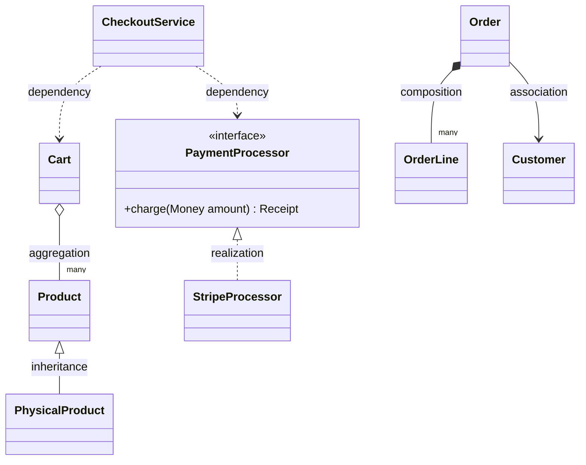
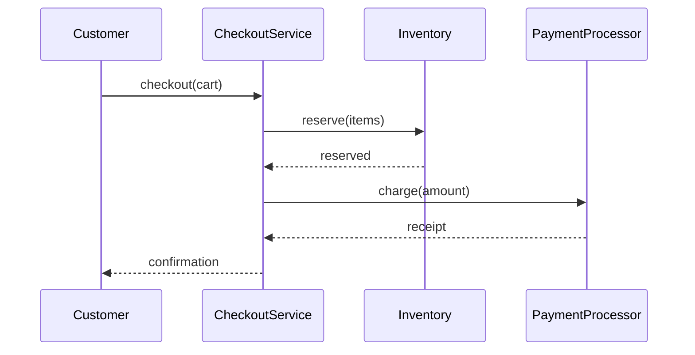
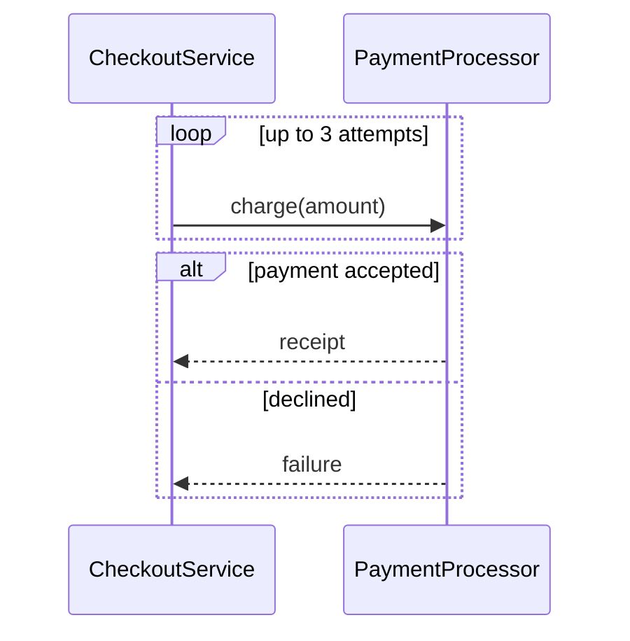

# Modeling with UML

A design exists in your head as a set of objects and the way they talk to each other. UML is the shared notation for getting that design onto a page precisely enough that someone else — an interviewer, a teammate, or future you — reconstructs the same design you meant. It is easy to over-learn: the full specification has more than a dozen diagram types and a large vocabulary of arrows. Low-level design needs only two of the diagrams and only a handful of the arrows. This note covers that working subset and ignores the rest.

The two diagrams answer two different questions. A class diagram shows *structure* — what types exist and how they relate — frozen, with no notion of time. A sequence diagram shows *behavior* — how particular objects collaborate, in order, to carry out one scenario. Structure is the skeleton; behavior is the skeleton in motion. Most designs need both, because a set of classes can look correct on paper and still collaborate badly at runtime.

## Class diagrams

The purpose of a class diagram is to make the relationships between types explicit, because the relationships are where the design decisions live. The classes themselves are almost incidental; the connectors between them encode whether one type owns another, merely uses it, or claims to be a kind of it. The mechanism is one box per type and one typed connector per relationship, where the *kind* of connector carries the meaning.

A class box has three compartments — the name, the fields, and the methods — with visibility marked `+` for public, `-` for private, and `#` for protected.



Only a few relationships carry real weight, and they differ precisely in how tightly they bind two types. They are listed from loosest to tightest, where tighter means each type knows more about the other and a change is likelier to force a change across the link:

- **Dependency (transient use)** — a dashed arrow, the weakest link. One type uses another briefly, as a method parameter or local variable, without retaining it as a field.
- **Association (uses / knows)** — a plain solid line. A lasting link that is neither ownership nor kinship.
- **Aggregation (shared has-a)** — a solid line with a hollow diamond at the owner. One object is made up of other objects that have their own independent lives: they can exist before it, outlive it, and be shared with other owners. Destroying the owner leaves them untouched. A cart is made up of products, but the products live in the catalog on their own.
- **Composition (exclusive has-a)** — a solid line with a filled diamond at the owner. One object is made up of other objects that belong to it alone: nobody else references them, and when the owner is destroyed they are destroyed with it. An order is made up of order lines that exist only as long as that order does.
- **Realization (implements)** — a dashed line with a hollow triangle pointing at the interface. A type fulfilling a contract.
- **Inheritance (is-a)** — a solid line with a hollow triangle pointing at the parent. The child is a kind of the parent and substitutable for it. This is the strongest and most rigid binding, and the one to justify most carefully.

In code, each relationship has a distinct shape — a parameter versus a field, an object passed in versus one created inside. All six below belong to one checkout system:

```java
class Order {
    private Customer customer;                                  // association — referenced, lives on its own
    private final List<OrderLine> lines = new ArrayList<>();    // composition — created and owned here

    void addLine(Product product, int qty) {
        lines.add(new OrderLine(product, qty));                 // each line dies with the order
    }
}

class Cart {
    private final List<Product> products;                       // aggregation — products live in the catalog,
    Cart(List<Product> products) { this.products = products; }  // passed in and shared across carts
}

class PhysicalProduct extends Product { }                       // inheritance — a kind of Product

class StripeProcessor implements PaymentProcessor {            // realization — fulfills the contract
    public Receipt charge(Money amount) { /* ... */ }
}

class CheckoutService {
    Order checkout(Cart cart, PaymentProcessor processor) {     // dependency — used only as parameters
        /* build the order from the cart, then processor.charge(...) */
    }
}
```

Choosing the weakest connector that still expresses the design is the same instinct as preferring composition to inheritance: the looser the binding, the more freely each type can change on its own.

The whole checkout system puts all six relationships in one picture:



Read back, the diagram states every decision at a glance: an `Order` owns its `OrderLine`s (composition) and merely references its `Customer` (association); a `Cart` is made up of catalog `Product`s that outlive it (aggregation); `PhysicalProduct` is a kind of `Product` (inheritance); `StripeProcessor` fulfils the `PaymentProcessor` contract (realization); and `CheckoutService` touches a `Cart` and a `PaymentProcessor` only in passing (dependency). Prose cannot state ownership and substitutability that compactly.

## Sequence diagrams

The purpose of a sequence diagram is to show how objects collaborate over time to satisfy one scenario — a single path such as "place an order," not every possible path. Where a class diagram shows who *can* talk to whom, a sequence diagram shows who *does*, in what order, for one story. It is the fastest way to catch a collaboration that is wrong even when the classes are right: one object making every call, or a simple request bouncing through six hops to get done.

The mechanism is a lifeline for each participant — a vertical line dropping from each object — and horizontal arrows for messages between them, read strictly top to bottom as time. A solid arrowhead is a synchronous call; a dashed arrow is its return.



Control fragments handle the paths that are not a straight line. An `alt` block holds mutually exclusive branches (payment succeeds or fails); a `loop` block repeats a message (retry the charge up to three times); an `opt` block is a step that may be skipped. They keep one scenario honest without splitting it into a separate diagram per outcome.



The diagram is a design tool, not just documentation. If drawing it makes one lifeline sprout arrows to every other while the rest sit idle, the design has piled too much responsibility into one place — the picture surfaces that concentration before the code does.

## What to skip

UML also has state machines, activity diagrams, use-case diagrams, and more. They have their place, but low-level design rarely reaches for them and an interview almost never asks. The working skill is to turn a problem into a class diagram of the types and their relationships, then a sequence diagram for each important flow. Those two carry the large majority of what it takes to communicate a design.
